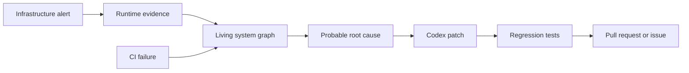
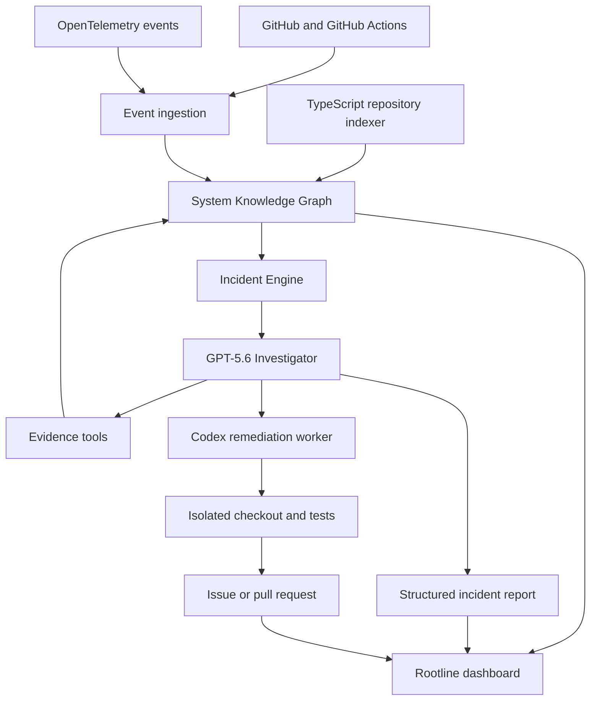

# Rootline — первоначальный план MVP

> Living system graph that traces an incident from infrastructure to the responsible code change and produces a verified fix.

| Поле | Значение |
| --- | --- |
| Статус | Initial MVP Plan / Draft v0.1 |
| Дата фиксации | 13 июля 2026 |
| Рабочее название | Rootline |
| Конкурс | OpenAI Build Week 2026 |
| Категория | Developer Tools |
| Официальный дедлайн | 21 июля 2026, 17:00 PDT |
| Дедлайн в Копенгагене | 22 июля 2026, 02:00 CEST |
| Внутренний дедлайн | 21 июля 2026, 20:00 CEST |

## 1. Краткое описание

Rootline — AI-система для расследования инженерных инцидентов. Она строит живой граф связей между кодом, сервисами, Git-коммитами, deployments, логами, traces и инфраструктурными метриками.

При появлении ошибки Rootline проходит по этому графу от наблюдаемого симптома до вероятного изменения в коде, собирает подтверждающие данные, формирует отчёт об инциденте и запускает безопасный remediation flow: подготовка исправления, regression test, проверка CI и создание pull request либо issue.

Ключевая формулировка MVP:

> Rootline detects a cross-layer production incident, traces it through a living system graph to the responsible code change, and produces a tested pull request.

## 2. Проблема

Данные для расследования инцидента распределены между разными системами:

- CI/CD показывает упавший pipeline;
- observability-система содержит логи, traces и metrics;
- Git хранит историю изменений;
- инфраструктура знает, какой container и deployment запущен;
- исходный код содержит реальные зависимости между сервисами и функциями.

Инженер вручную восстанавливает причинную цепочку между этими источниками. Обычный AI-чат с логами не знает фактическую структуру системы, плохо связывает runtime-сигналы с конкретным deployment и может выдавать неподтверждённые выводы.

## 3. Решение

Rootline объединяет три инженерных гейта вокруг одного System Knowledge Graph:

1. **Build Gate** — анализирует падения CI, воспроизводит ошибку и предлагает исправление.
2. **Runtime Gate** — расследует ошибки приложения по логам и traces.
3. **Infrastructure Gate** — связывает CPU, memory и container health с workload, deployment и кодом.

Это не три независимых AI-бота. Все сигналы поступают в общий incident engine и используют один граф доказательств.



## 4. Цель MVP

Продемонстрировать один законченный сценарий `incident → evidence → root cause → tested fix → pull request` на контролируемом TypeScript-проекте.

MVP должен доказать четыре утверждения:

1. Rootline понимает связи между runtime, deployment, commit и кодом.
2. Диагноз строится на наблюдаемых данных, а не только на предположении модели.
3. AI способен подготовить минимальное исправление и regression test.
4. Опасные действия остаются под контролем человека и заканчиваются pull request, а не прямым изменением production.

## 5. Основной пользователь

Основная аудитория MVP:

- backend-разработчик;
- DevOps/SRE-инженер;
- небольшая продуктовая команда без круглосуточной SRE-службы;
- tech lead, которому нужно быстрее локализовать причину production-инцидента.

Основная user story:

> Как дежурный инженер, я хочу получить доказуемую цепочку от инфраструктурного симптома до изменённой функции и проверенного исправления, чтобы сократить время ручного расследования и безопасно начать remediation.

## 6. Демонстрационная система

Для воспроизводимого сценария создаётся небольшой TypeScript monorepo из трёх сервисов:

- `checkout-service` — HTTP API оформления заказа;
- `inventory-service` — проверка и резервирование товара;
- `notification-worker` — асинхронная отправка уведомлений.

### Демонстрационный дефект

В `checkout-service` новый commit убирает ограничение или TTL у in-memory cache.

Ожидаемая последовательность:

1. После deployment размер cache начинает непрерывно расти.
2. Увеличивается heap usage и latency.
3. Появляются HTTP 500 и связанные trace-события.
4. Infrastructure Gate создаёт исходный сигнал.
5. Runtime Gate связывает ошибки с `checkout-service` и конкретным endpoint.
6. Граф связывает service с deployment, commit и изменённым cache-классом.
7. GPT-5.6 формирует структурированный диагноз с evidence.
8. Codex создаёт минимальный patch и regression test.
9. Тесты проходят в изолированной рабочей копии.
10. Rootline создаёт pull request либо полностью воспроизводимый PR preview.
11. После исправления replay показывает стабилизацию памяти.

Один дефект покрывает все три гейта:

```text
Infrastructure anomaly
  → runtime errors and traces
  → deployment and commit correlation
  → code-level root cause
  → automated remediation
  → CI verification
```

## 7. Scope MVP

### 7.1 Обязательно реализовать

- индексирование одного TypeScript monorepo;
- извлечение базовых связей между файлами, сервисами и функциями;
- привязка deployment к Git commit SHA;
- ingestion подготовленных logs, traces и memory metrics;
- детерминированный replay одного production-инцидента;
- создание incident на основании runtime/infrastructure signal;
- выбор релевантной части графа для расследования;
- структурированный ответ GPT-5.6 с root cause, evidence и confidence;
- визуализация причинной цепочки;
- запуск Codex для подготовки patch и regression test;
- выполнение тестов в изолированной рабочей копии;
- создание GitHub issue или pull request;
- audit trail действий агента;
- README с локальным запуском и sample data;
- публичное demo video продолжительностью менее трёх минут.

### 7.2 Желательно, если основной flow готов

- обработка упавшего GitHub Actions workflow;
- повторный запуск CI после исправления;
- режим сравнения метрик до и после patch;
- несколько уровней confidence;
- краткий автоматически созданный runbook;
- hosted demo или готовый Docker Compose sandbox.

### 7.3 Не входит в MVP

- прямое изменение production;
- автоматический Kubernetes rollback или scaling;
- полноценный Kubernetes operator;
- поддержка нескольких языков программирования;
- multi-cloud инфраструктура;
- универсальное anomaly detection;
- полноценные интеграции Slack, Jira, PagerDuty и Grafana;
- отдельный generic chat with code/docs;
- обучение собственной модели;
- анализ произвольной enterprise-кодовой базы без настройки.

## 8. Функциональные требования

### FR-1. Repository indexing

Система должна построить минимальный граф TypeScript-проекта и сохранить происхождение каждой связи.

Минимальные типы узлов:

- `Repository`;
- `Service`;
- `File`;
- `Function`;
- `Endpoint`;
- `Commit`;
- `Deployment`;
- `Container`;
- `Trace`;
- `LogEvent`;
- `MetricEvent`;
- `Incident`;
- `Evidence`.

Минимальные типы связей:

```text
Service    --OWNS----------> File
File       --IMPORTS-------> File
Endpoint   --CALLS---------> Function
Deployment --USES----------> Commit
Container  --RUNS----------> Deployment
Trace      --TOUCHES-------> Endpoint
LogEvent   --OBSERVED_IN---> Service
Incident   --SUPPORTED_BY--> Evidence
```

### FR-2. Telemetry ingestion

Система должна принимать нормализованные события:

- timestamp;
- service name;
- deployment/commit identifier;
- trace ID;
- severity;
- message;
- metric name and value;
- container/workload identifier.

Для MVP допустим replay заранее записанного набора OpenTelemetry-совместимых событий.

### FR-3. Incident creation

При превышении заданного memory threshold или появлении последовательности ошибок система должна:

1. создать incident;
2. определить затронутый service;
3. прикрепить исходные события как evidence;
4. запустить investigation workflow.

### FR-4. Investigation

Investigator должен использовать ограниченный набор инструментов:

- `get_incident_events`;
- `get_graph_neighbors`;
- `get_recent_deployments`;
- `get_commit_diff`;
- `get_related_logs`;
- `get_trace`;
- `search_code`;
- `run_test`.

Результат должен соответствовать структурированной схеме:

```json
{
  "summary": "string",
  "affectedService": "string",
  "probableRootCause": "string",
  "confidence": 0.0,
  "evidenceIds": ["string"],
  "recommendedAction": "string",
  "safeToAttemptFix": false
}
```

Каждое существенное утверждение должно ссылаться хотя бы на один `evidenceId`.

### FR-5. Remediation

После подтверждения пользователем система должна:

1. создать изолированную рабочую копию repository;
2. передать Codex описание дефекта и собранный evidence;
3. получить минимальный patch;
4. добавить или обновить regression test;
5. выполнить тесты;
6. показать diff и результаты тестов;
7. создать pull request только при успешной проверке;
8. создать issue вместо PR, если исправление не прошло проверку.

### FR-6. Dashboard

Главный экран должен содержать:

- список активных incidents;
- статус системы и текущие метрики;
- визуальный граф причинной цепочки;
- evidence timeline;
- probable root cause и confidence;
- diff предлагаемого исправления;
- результаты тестов;
- кнопки `Investigate`, `Generate fix`, `Create issue`, `Open pull request`.

Чат не является основным интерфейсом MVP.

## 9. Нефункциональные требования

- Полный replay demo должен укладываться в 2 минуты 30 секунд, оставляя время на объяснение в видео.
- Investigation одного подготовленного incident должна завершаться не более чем за 60 секунд.
- Все действия агента должны отображаться в audit trail.
- Любая ошибка отдельного шага должна завершаться понятным состоянием, а не зависшим workflow.
- Demo flow должен воспроизводиться одной командой или через Docker Compose.
- Секреты не должны попадать в repository, логи или prompt context.
- Для judges должны быть sample data и чёткие инструкции запуска.

## 10. Безопасность и уровни автономности

MVP использует четыре логических уровня:

| Уровень | Разрешённое действие |
| --- | --- |
| Observe | Чтение данных и построение графа |
| Recommend | Диагноз, issue draft и patch preview |
| Act with approval | Запуск Codex и создание PR после подтверждения |
| Auto-fix | Зарезервировано; не используется для production в MVP |

Ограничения:

- нет прямого push в default branch;
- нет команд в production infrastructure;
- нет автоматического merge;
- исправление выполняется в sandbox/isolated checkout;
- PR создаётся только после успешных тестов;
- все tool calls сохраняются для просмотра.

## 11. Предлагаемая архитектура



### Рекомендуемый стек

- **Frontend:** Next.js, TypeScript, React Flow или Cytoscape;
- **Backend:** NestJS либо Node.js/TypeScript;
- **Storage:** PostgreSQL;
- **Telemetry:** OpenTelemetry-compatible JSON/replay;
- **AI investigation:** GPT-5.6 через Responses API и function tools;
- **Code remediation:** Codex в изолированной рабочей копии;
- **Repository integration:** GitHub API;
- **Local demo:** Docker Compose.

Для MVP отдельная graph database не требуется. Узлы и связи можно хранить в PostgreSQL:

```text
nodes(id, type, key, properties, source)
edges(id, from_node_id, to_node_id, type, properties, source)
events(id, type, occurred_at, payload, node_id)
incidents(id, status, severity, summary, created_at)
evidence(id, incident_id, source_type, source_id, payload)
agent_runs(id, incident_id, status, started_at, completed_at)
agent_steps(id, agent_run_id, tool, input, output, status)
```

## 12. Предлагаемая структура repository

```text
apps/
  web/                 # Dashboard
  api/                 # HTTP API and orchestration
  worker/              # Investigation and remediation jobs
packages/
  graph/               # Graph model, indexer and queries
  telemetry/           # Event normalization and replay
  agents/              # GPT-5.6 tools and schemas
  github/              # GitHub integration
  shared/              # Shared types and utilities
demo/
  services/            # Checkout, inventory, notification
  telemetry/           # Recorded incident events
  scripts/             # Incident replay and reset
docs/
  MVP_PLAN.md
```

Структура является ориентиром и может быть упрощена после создания первого vertical slice.

## 13. Demo flow до трёх минут

| Время | Сцена |
| --- | --- |
| 00:00–00:20 | Здоровая система и живой граф связей |
| 00:20–00:45 | Запуск replay проблемного deployment |
| 00:45–01:10 | Рост memory, HTTP 500 и автоматическое создание incident |
| 01:10–01:40 | Подсветка пути container → deployment → commit → function |
| 01:40–02:05 | GPT-5.6 показывает диагноз и evidence |
| 02:05–02:35 | Codex создаёт patch и regression test |
| 02:35–02:50 | Тесты проходят, появляется pull request |
| 02:50–03:00 | Сравнение до/после и финальная ценность продукта |

Replay ускоряет течение времени, но события, investigation, patch и тесты должны обрабатываться реальной системой.

## 14. Критерии готовности MVP

MVP считается готовым, если выполняются все условия:

- [ ] Demo repository запускается локально по инструкции.
- [ ] Indexer строит граф трёх сервисов.
- [ ] Deployment связан с конкретным commit SHA.
- [ ] Incident replay воспроизводится детерминированно.
- [ ] Система автоматически создаёт incident.
- [ ] UI показывает путь от metric/log до функции или файла.
- [ ] GPT-5.6 возвращает валидный структурированный диагноз.
- [ ] Диагноз содержит ссылки на evidence.
- [ ] Codex создаёт минимальное исправление.
- [ ] Добавлен regression test.
- [ ] Тесты выполняются и результат отображается в UI.
- [ ] Система создаёт PR либо воспроизводимый PR preview.
- [ ] Ни одно действие не изменяет production или default branch.
- [ ] Есть audit trail investigation и remediation.
- [ ] Есть README, sample data и инструкция для judges.
- [ ] Записано публичное видео короче трёх минут.
- [ ] В submission указан Codex `/feedback` Session ID основной разработки.

## 15. Метрики успеха

Для MVP используются демонстрационные, а не маркетинговые метрики:

- время от первого alert до созданного incident;
- время от incident до probable root cause;
- число переходов в доказанной причинной цепочке;
- доля существенных выводов с evidence reference — целевое значение 100%;
- успешность regression test до и после patch;
- длительность полного demo flow;
- воспроизводимость demo в чистом окружении.

## 16. План реализации

### 13 июля — фиксация scope

- утвердить MVP plan;
- создать repository structure;
- выбрать окончательный demo defect;
- зафиксировать event schema и graph schema.

### 14 июля — demo system и vertical slice

- создать три demo services;
- добавить воспроизводимый cache defect;
- настроить базовые тесты;
- получить первый полный локальный failure scenario.

### 15 июля — Knowledge Graph

- реализовать TypeScript indexer;
- сохранить nodes и edges;
- связать service, deployment и commit;
- вывести первый интерактивный граф.

### 16 июля — Telemetry и Incident Engine

- подготовить logs, traces и memory metrics;
- реализовать replay;
- создать threshold detector;
- автоматически создавать incident и evidence.

### 17 июля — GPT-5.6 Investigator

- реализовать tool interface;
- добавить structured output schema;
- ограничить investigation релевантным subgraph;
- проверить evidence-backed diagnosis.

### 18 июля — Codex remediation

- создать isolated checkout flow;
- передать Codex incident context;
- сгенерировать patch и regression test;
- выполнить тесты;
- подготовить issue/PR integration.

### 19 июля — Product UI

- собрать incident list;
- показать causal graph и timeline;
- добавить evidence panel, diff и test results;
- связать UI в единый сценарий.

### 20 июля — стабилизация

- провести несколько полных replay;
- исправить нестабильные шаги;
- подготовить Docker Compose и README;
- проверить чистую установку;
- записать черновое видео.

### 21 июля — submission

- финальный прогон;
- записать и загрузить публичное видео;
- оформить Devpost description;
- проверить repository access и setup instructions;
- добавить Codex Session ID;
- отправить работу до внутреннего дедлайна 20:00 CEST.

## 17. Основные риски и способы сокращения

| Риск | Решение для MVP |
| --- | --- |
| Слишком широкий scope | Один incident, один язык, один repository |
| Нестабильное AI-расследование | Маленький subgraph, строгая schema, фиксированный tool set |
| Модель придумывает доказательства | Evidence IDs и детерминированное извлечение связей |
| Codex создаёт слишком большой patch | Явное ограничение diff, regression test, human approval |
| Интеграция GitHub занимает слишком много времени | Сначала PR preview, затем реальный PR |
| Observability stack усложняет запуск | Recorded OTEL-compatible replay вместо полноценного production stack |
| Demo не укладывается в три минуты | Ускоренный replay и заранее проиндексированный repository |
| Сбой внешнего API во время записи | Повторяемый локальный reset и возможность нескольких дублей |

## 18. Зафиксированные решения

1. Рабочее название продукта — **Rootline**.
2. Основная категория конкурса — **Developer Tools**.
3. Главная ценность — не мониторинг сам по себе, а переход от incident к проверенному исправлению.
4. Knowledge Graph является ядром продукта, а не отдельной функцией.
5. Первый поддерживаемый стек — TypeScript.
6. Первый incident — unbounded cache/memory growth после deployment.
7. Базовые связи графа извлекаются детерминированно.
8. GPT-5.6 используется для investigation и принятия решения на основании evidence.
9. Codex используется для создания и проверки code remediation.
10. Максимальное автоматическое действие MVP — создание pull request; production не изменяется.
11. PostgreSQL достаточно для первой реализации графа.
12. Slack, Jira, Kubernetes automation и multi-language support отложены.

## 19. Открытые вопросы

Эти решения не блокируют первый vertical slice, но должны быть закрыты не позднее 15 июля:

- использовать NestJS или минимальный Node.js backend;
- выбрать React Flow или Cytoscape;
- создавать реальный GitHub PR или сначала PR preview;
- вызывать Codex локально или через выбранный программный integration flow;
- использовать PostgreSQL с первого дня или временный in-memory graph для vertical slice;
- показывать confidence от модели либо вычислять итоговый score по наличию evidence.

## 20. Соответствие критериям конкурса

| Критерий | Что показывает Rootline |
| --- | --- |
| Technological Implementation | Граф системы, tool-using investigation, Codex remediation и тестирование |
| Design | Цельный incident-to-PR интерфейс вместо набора отдельных demo screens |
| Potential Impact | Сокращение ручного поиска причины и безопасное начало remediation |
| Quality of the Idea | Межуровневая причинная связь между infrastructure, runtime, deployment и code |

## 21. Материалы для submission

До подачи должны быть подготовлены:

- рабочий project repository;
- README с setup instructions;
- sample telemetry и incident replay;
- публичное видео менее трёх минут;
- project description;
- описание использования GPT-5.6;
- описание того, где Codex ускорил разработку и выполняет remediation;
- Codex `/feedback` Session ID;
- hosted demo, sandbox или максимально простой локальный запуск.

## 22. Ссылки

- [OpenAI Build Week](https://openai.com/build-week/)
- [OpenAI Build Week на Devpost](https://openai.devpost.com/)
- [GPT-5.6 Sol — документация модели](https://developers.openai.com/api/docs/models/gpt-5.6-sol)

---

Этот документ фиксирует исходный MVP scope. Любая новая функция должна добавляться только после завершения рабочего vertical slice `incident → evidence → root cause → tested fix → pull request`.
