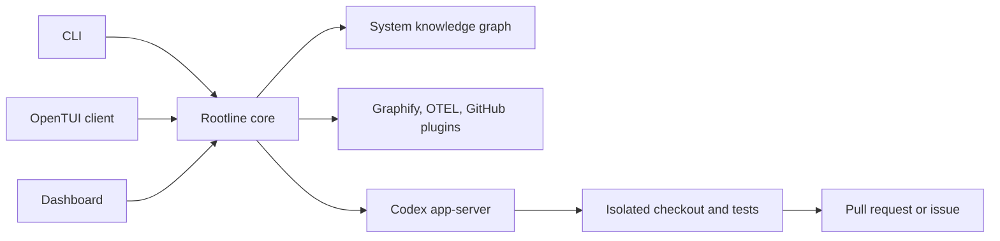

# Rootline

Rootline is an AI system for investigating engineering incidents. It connects infrastructure signals, runtime evidence, deployments, commits, and code into a living system graph, then uses Codex to produce a tested remediation through an approval-gated workflow.

> Status: architecture scaffold only. The repository does not contain a runnable implementation yet.

## MVP outcome

The initial vertical slice is:

```text
incident → evidence → root cause → tested fix → pull request
```

The canonical product documents are:

- [MVP plan](docs/MVP_PLAN.md)
- [Use cases](docs/USE_CASES.md)

## System shape



`apps/core` owns incident state, evidence, approvals, remediation, and audit history. CLI, TUI, and dashboard are clients of the same core contract; they must not duplicate workflow decisions or connect directly to storage or Codex.

## Repository map

| Path | Responsibility |
| --- | --- |
| `apps/core` | Rootline core service, orchestration, incident engine, approvals, and audit trail |
| `apps/cli` | Scriptable, non-interactive commands and machine-readable output |
| `apps/tui` | Interactive terminal client built with OpenTUI |
| `apps/dashboard` | Primary browser dashboard for the demo flow |
| `packages/codex-protocol` | Generated TypeScript and JSON Schema for the pinned Codex app-server version |
| `packages/codex-app-server-client` | JSON-RPC lifecycle, event streaming, approvals, and process communication |
| `packages/contracts` | Shared Rootline API, event, and persistence-boundary schemas |
| `packages/client` | Typed Rootline client used by CLI, TUI, and dashboard |
| `packages/domain` | Incident, evidence, autonomy, and safety rules |
| `packages/plugin-sdk` | Plugin manifests and capability contracts |
| `plugins` | First-party Graphify, OpenTelemetry replay, and GitHub adapters |
| `vendor/codex` | Reserved for a pinned upstream [OpenAI Codex](https://github.com/openai/codex) checkout if source vendoring is selected |
| `scenarios` | Versioned incident fixtures shared by demo, evals, and benchmarks |
| `evals` | Product-quality evaluation suites and deterministic scorers |
| `benchmarks` | Latency, stability, resource, token, and cost measurements |
| `tests` | Unit, contract, integration, and end-to-end correctness tests |
| `demo` | Judge-facing orchestration for the canonical scenario |
| `scripts` | Repository-supported setup, replay, reset, and validation commands |

## Codex app-server

Codex is a required execution runtime, not an optional plugin.

The intended boundary is:

```text
pinned Codex runtime
  → generated protocol
  → codex app-server client
  → Rootline core
  → CLI / TUI / dashboard
```

The first implementation should launch `codex app-server` over stdio from `apps/core`, initialize one connection, start or resume threads, stream item and turn events into the audit trail, and route approval requests through Rootline. Clients communicate with Rootline core rather than the raw Codex protocol.

Do not manually edit generated Codex protocol files. Regenerate them from the pinned Codex version and validate the client against that version.

## Scenarios, evals, benchmarks, and tests

These areas answer different questions:

- `scenarios`: what reproducible incident happened and what outcome is expected?
- `evals`: did Rootline identify the right cause, cite valid evidence, and make a safe decision?
- `benchmarks`: how fast, stable, and expensive was the run?
- `tests`: did the implementation satisfy its software contracts?

The canonical demo uses `scenarios/cache-growth`. Negative and adversarial controls live beside it so benchmark claims do not depend on a single happy path.

Initial product gates from the MVP plan include:

- investigation completes within 60 seconds;
- the complete replay fits within 150 seconds;
- every material diagnosis claim references evidence;
- failed tests never produce a pull request;
- no workflow mutates production or the default branch;
- every agent action is represented in the audit trail.

## Workstreams

The structure is intended to support parallel human and Codex work without overlapping ownership:

1. **Core and domain:** incident lifecycle, graph overlay, investigation, approvals, remediation, and audit.
2. **Codex runtime:** pinned app-server, generated protocol, process supervision, streamed events, and sandbox execution.
3. **Clients:** CLI, OpenTUI, dashboard, and the shared typed client.
4. **Plugins and scenarios:** Graphify, telemetry replay, GitHub, and deterministic incident fixtures.
5. **Quality:** tests, eval scorers, performance benchmarks, and reproducibility reports.

## Collaboration

Before starting a task, read [AGENTS.md](AGENTS.md), the MVP plan, and the relevant use case.

- Keep each pull request within one workstream where practical.
- Define observable acceptance criteria before non-trivial implementation.
- Changes to shared contracts must validate both producer and consumer sides.
- Keep clients thin; product decisions belong to core/domain.
- Keep external integrations behind plugin or runtime boundaries.
- Report primary user-visible or runtime validation, not only lint or typecheck.
- Do not commit secrets, raw credentials, customer data, or unredacted model context.

## Getting started

There is no installation or run command yet. The first implementation pull request should establish the workspace toolchain and add only commands that it verifies locally. Until then, contributors should select a workstream, define its first contract-level milestone, and avoid filling unrelated directories.
