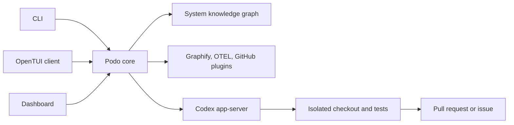

# Podo

**Podo** is short for **Podoroznyk** (Ukrainian: **подорожник**, plantain). In
folklore, its leaf is placed on a small wound to help it heal. Podo follows the
same metaphor for software: it finds an engineering incident, traces the wound
back to its cause, and prepares a safe, tested fix.

Podo connects infrastructure signals, runtime evidence, deployments, commits,
and code into a living system graph, then uses Codex to produce remediation
through an approval-gated workflow.

> **Status:** canonical POC complete. `bun run poc` verifies the pinned live
> Codex App Server and then executes the complete deterministic vertical slice
> through the real graph, replay, core, typed client, Codex remediation producer,
> isolated git worktree, red-to-green regression gate, and reproducible
> pull-request preview. The next MVP slice is also implemented as an explicit,
> disabled-by-default production composition: Core seals the exact tested Git
> tree, requires a separate delivery approval, publishes only a derived branch,
> and creates or reconciles the exactly matching GitHub pull request. The live
> GitHub path is covered with REST fakes and an isolated bare remote rather than
> a real repository write. Durable Core state/reconciliation and authenticated
> actor identity remain milestones before broader production use.

## MVP outcome

The initial vertical slice is:

```text
incident → evidence → root cause → tested fix → pull request
```

The canonical product documents are:

- [MVP plan](docs/MVP_PLAN.md)
- [Use cases](docs/USE_CASES.md)
- [Workstream ownership](docs/WORKSTREAMS.md)

## POC completion path

Podo is built as one real vertical flow, not as disconnected feature demos:

```text
canonical graph + telemetry replay
  → detected incident with evidence
  → structured Codex diagnosis with validated evidence references
  → explicit remediation approval
  → isolated patch and regression test
  → passing validation
  → reproducible pull-request preview
  → separate delivery approval
  → verified derived Git branch and exact GitHub pull request
```

The deterministic POC keeps state in memory and uses a fake pull-request
delivery port so `bun run poc` remains offline and reproducible. The same sealed
artifact now has an opt-in real GitHub delivery composition for operator runs.
The MVP still needs durable operations and reconciliation, authenticated actor
identity, complete audit persistence, judge setup, eval baselines, benchmarks,
and final submission artifacts. Failed validation must never reach either path.

## System shape



`apps/core` owns incident state, evidence, approvals, remediation, and audit history. CLI, TUI, and dashboard are clients of the same core contract; they must not duplicate workflow decisions or connect directly to storage or Codex.

## Repository map

| Path | Responsibility |
| --- | --- |
| `apps/core` | Podo core service, orchestration, incident engine, approvals, and audit trail |
| `apps/cli` | Scriptable, non-interactive commands and machine-readable output |
| `apps/tui` | Interactive terminal client built with OpenTUI |
| `apps/dashboard` | Primary browser dashboard for the demo flow |
| `packages/codex-protocol` | Generated TypeScript and JSON Schema for the pinned Codex app-server version |
| `packages/codex-app-server-client` | JSON-RPC lifecycle, event streaming, approvals, and process communication |
| `packages/contracts` | Shared Podo API, event, and persistence-boundary schemas |
| `packages/client` | Typed Podo client used by CLI, TUI, and dashboard |
| `packages/domain` | Incident, evidence, autonomy, and safety rules |
| `packages/plugin-sdk` | Plugin manifests and capability contracts |
| `plugins` | First-party Graphify, OpenTelemetry replay, and GitHub adapters |
| `vendor/codex` | Reserved for a pinned upstream [OpenAI Codex](https://github.com/openai/codex) checkout if source vendoring is selected |
| `scenarios` | Versioned incident fixtures shared by demo, evals, and benchmarks |
| `evals` | Product-quality evaluation suites and deterministic scorers |
| `benchmarks` | Latency, stability, resource, token, and cost measurements |
| `tests` | Unit, contract, integration, and end-to-end correctness tests |
| `demo` | Judge-facing orchestration for the canonical scenario |
| `scripts` | Repository-supported setup, replay, reset, and validation commands |

## Codex app-server

Codex is a required execution runtime, not an optional plugin.

The intended boundary is:

```text
pinned Codex runtime
  → generated protocol
  → codex app-server client
  → Podo core
  → CLI / TUI / dashboard
```

Core owns one supervised `codex app-server --stdio` connection. The transport initializes it once, frames JSONL, correlates requests, surfaces notifications and server-initiated requests, and fails pending work on timeout, abort, EOF, or process exit. The runtime adapter starts or resumes one Codex thread per investigation and maps Codex messages into stable Podo runtime events. Raw Codex protocol and thread IDs do not cross the core boundary.

The pinned TypeScript SDK was evaluated but is not used by this path. At the pinned revision it launches `codex exec --experimental-json` per turn and exposes batch item/turn events, but not the long-lived App Server approval, user-input, steer, or server-request contract. It may later fit isolated batch/eval adapters behind the same runtime port; Direct App Server remains the default interactive runtime and the only state authority is core.

## Investigation API foundation

The current core implementation is intentionally in-memory. It owns investigation lifecycle, approval decisions, the Codex-to-investigation association, and a bounded ordered event log (256 events by default).

| Method | Endpoint | Purpose |
| --- | --- | --- |
| `POST` | `/api/incidents/:id/investigation` | Start a core-owned, evidence-backed, read-only investigation for a detected incident |
| `POST` | `/api/investigations` | Start with required `prompt`, absolute `cwd`, and `sandbox` (`read-only` or `workspace-write`) |
| `GET` | `/api/investigations/:id` | Read authoritative state and the current pending approval |
| `DELETE` | `/api/investigations/:id` | Deny a pending approval, interrupt the active turn, and cancel |
| `POST` | `/api/investigations/:id/approvals/:approvalId` | Submit explicit `approve` or `deny`; user-input approvals may include `answers` |
| `GET` | `/api/investigations/:id/events` | Stream ordered SSE events; reconnect with `Last-Event-ID` or `?after=` |

The lifecycle exposed to clients is `starting → running ↔ waiting_for_approval → completed | cancelled | failed`. Approval requests never receive a default approval. A Codex EOF or crash fails every active investigation explicitly and degrades readiness. A later investigation performs one controlled lazy connection replacement; old thread/turn mutations are never retried, and readiness recovers only after the fresh runtime is established. If an SSE cursor predates the bounded retained log, core returns `409 event_replay_expired` rather than silently skipping events.

The typed `@podo/client` exposes the safe incident command
`startIncidentInvestigation` plus lower-level investigation lifecycle methods.
For a local HTTP check:

```sh
bun run dev:core
curl -N -X POST http://127.0.0.1:4100/api/investigations \
  -H 'content-type: application/json' \
  -d '{"prompt":"Investigate the incident evidence","cwd":"/absolute/path/to/sandbox","sandbox":"workspace-write"}'
```

### Read-only agent chat

UI and TUI clients can use the same long-lived App Server runtime for bounded,
multi-turn operator questions without receiving Codex thread or turn IDs. Core
owns the repository directory, developer instructions, read-only sandbox, and
approval policy. Callers can submit only trimmed message text and an idempotency
key; any command, file-change, permission, or user-input approval is denied and
the chat fails closed.

| Method | Endpoint | Purpose |
| --- | --- | --- |
| `GET` | `/api/agent/readiness` | Prove configuration, exact pinned Codex compatibility, and a live App Server handshake |
| `POST` | `/api/agent/chats` | Create a Core-owned read-only chat; accepts only `{}` |
| `GET` | `/api/agent/chats/:id` | Read the typed public history and state |
| `POST` | `/api/agent/chats/:id/messages` | Send `{ content, clientRequestId }` |
| `DELETE` | `/api/agent/chats/:id/turn` | Interrupt the current turn |
| `GET` | `/api/agent/chats/:id/events` | Stream the bounded current turn over SSE |

Production composition is disabled by default. Enable it only for one trusted
operator-selected repository:

```sh
PODO_AGENT_CHAT_ENABLED=true
PODO_AGENT_CHAT_CWD=/absolute/path/to/repository
```

This is an operational Podo surface, not a generic autonomous coding chat. Chat
turns have a Core-owned 90-second deadline, and SSE sends keep-alive comments so
normal model latency does not look like a disconnected client. Chat state is in
memory, so restart recovery and authenticated remote actors remain out of scope
for this local/POC slice.

Do not manually edit generated Codex protocol files. Regenerate them from the pinned Codex version and validate the client against that version.

## Scenarios, evals, benchmarks, and tests

These areas answer different questions:

- `scenarios`: what reproducible incident happened and what outcome is expected?
- `evals`: did Podo identify the right cause, cite valid evidence, and make a safe decision?
- `benchmarks`: how fast, stable, and expensive was the run?
- `tests`: did the implementation satisfy its software contracts?

The canonical demo uses `scenarios/cache-growth`. Negative and adversarial controls live beside it so benchmark claims do not depend on a single happy path.

The canonical POC is one command:

```sh
bun run poc
```

The judge-facing demo experience is also one command:

```sh
bun run demo
```

It checks Codex compatibility, builds the production Dashboard, and starts one
connected deterministic Core-backed flow. The visible incident, causal path,
diagnosis, approvals, tested diff, delivery state, and audit all come through
the typed Core API. GitHub delivery is deterministic and performs no external
writes. See
[`demo/README.md`](demo/README.md) for prerequisites, expected state, ports, and
reset behavior.

The command first performs a real handshake with the pinned Codex App Server.
It then proves the canonical fixture reaches a detected evidence-backed
incident, resolves `deploy-1042 → trusted commit → cache.ts → CheckoutCache`,
and exposes only a validated `podo.diagnosis.v1`. `safeToAttemptFix` does not
grant mutation authority: the test observes a pending remediation with no
worktree or patch, submits an explicit approval through `@podo/client`, and only
then runs the production Codex remediation producer against a deterministic
runtime double at the App Server boundary. The producer uses two turns in one
thread to write a regression and a minimal fix inside a detached checkout. Podo
independently requires the regression to fail before the fix, pass afterward,
runs package validation, verifies the exact diff, cleans the worktree, and emits
a stable PR preview while leaving the source checkout and default branch intact.
It then compares the incident telemetry with the deterministic post-fix replay
and requires a versioned `stabilized` report covering heap growth, peak usage,
error events, and deployment identities.

The deterministic runtime double keeps this proof reproducible and offline; it
does not replace the live App Server. `bun run codex:smoke` is the live protocol
compatibility signal. Local/POC Core operators can opt into the same verified
executor through the fail-closed `PODO_REMEDIATION_*` configuration documented in
[`apps/core/README.md`](apps/core/README.md); remediation and investigations
share one supervised App Server runtime. Operators may additionally enable the
separately approved `PODO_GITHUB_*` delivery composition described there; it
binds the local trusted ref, GitHub repository/base branch, exact result tree,
derived head, and pull-request content before reporting delivery success.
The same Core module also supports an independently enabled, idempotent GitHub
issue fallback for unsafe or failed remediation and an incident-wide
investigation/issue audit endpoint.

Initial product gates from the MVP plan include:

- investigation completes within 60 seconds;
- the complete replay fits within 150 seconds;
- every material diagnosis claim references evidence;
- failed tests never produce a pull request;
- no workflow mutates production or the default branch;
- every agent action is represented in the audit trail.

## Workstreams

The structure is intended to support parallel human and Codex work without overlapping ownership:

1. **Core and domain:** incident lifecycle, graph overlay, investigation, approvals, remediation, and audit.
2. **Codex runtime:** pinned app-server, generated protocol, process supervision, streamed events, and sandbox execution.
3. **Clients:** CLI, OpenTUI, dashboard, and the shared typed client.
4. **Plugins and scenarios:** Graphify, telemetry replay, GitHub, and deterministic incident fixtures.
5. **Quality:** tests, eval scorers, performance benchmarks, and reproducibility reports.

## Collaboration

Before starting a task, read [AGENTS.md](AGENTS.md), the MVP plan, and the relevant use case.

- Keep each pull request within one workstream where practical.
- Define observable acceptance criteria before non-trivial implementation.
- Changes to shared contracts must validate both producer and consumer sides.
- Keep clients thin; product decisions belong to core/domain.
- Keep external integrations behind plugin or runtime boundaries.
- Report primary user-visible or runtime validation, not only lint or typecheck.
- Do not commit secrets, raw credentials, customer data, or unredacted model context.

## Getting started

Clone the repository with the pinned Codex upstream checkout and install the Bun workspace:

```sh
git clone --recurse-submodules git@github.com:reseaxch/podo.git
cd podo
bun install
```

Verify the complete foundation:

```sh
bun run codex:generate
bun run codex:smoke
bun run check
```

## Continuous integration

GitHub Actions runs three required checks for every pull request and every push
to `main`:

- `Workspace`: frozen Bun install followed by all workspace typechecks, tests,
  and builds;
- `Dashboard`: formatting, lint, component tests, and Chromium Playwright flows;
- `Codex compatibility`: installs Codex CLI `0.144.1`, matching the generated
  protocol metadata, and performs the live App Server handshake.

Production deployment is intentionally not automated yet. Durable Core state,
reconciliation, authenticated actor identity, and the production secrets
perimeter remain explicit prerequisites for CD.

Run the complete canonical POC gate:

```sh
bun run poc
```

Run the deterministic runtime and orchestration tests without a live Codex process:

```sh
bun test packages/codex-app-server-client apps/core packages/client
```

Run individual surfaces:

```sh
bun run dev:core
bun run dev:cli -- health
bun run dev:tui
bun run dev:dashboard
```

Check whether the pinned Codex revision differs from upstream:

```sh
bun run codex:upstream:status
```

Updating Codex is explicit because it also regenerates the version-specific protocol and runs the app-server handshake smoke:

```sh
bun run codex:upstream:update
```
